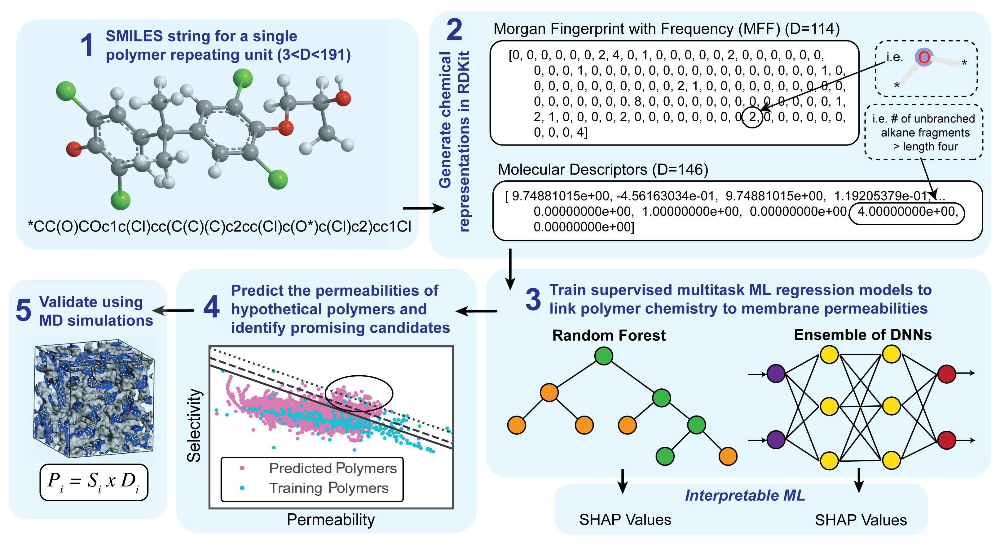

# PolymerGasMembraneML (pgmML)
A machine-learning implementation that learns generalizable, interpretable models between polymer chemistry and membrane gas permeability, which can be used for polymer discovery. Please refer to our work "Machine learning enables interpretable discovery of innovative polymers for gas separation membranes" for additional details.



## Installation
To download, clone this repository
```
git clone https://github.com/jsunn-y/PolymerGasMembraneML
```
To run most code in this repository, the relevant anaconda environment can be installed from `pgmML.yml`. To build this environment, run
```
cd ./PolymerGasMembraneML
conda env create -f pgmML.yml
conda activate pgmML
```
However, for calculating chemical descriptors and fingerprints (optional task), a separate rdkit environment is required. Installation instructions can be found in [rdkit documentation](https://www.rdkit.org/docs/Install.html).

## Datasets
In addition to the training dataset, Dataset A, we use 3 screening datasets in this work: Dataset B, C, and D. Dataset A has both SMILES strings (chemistry) and permeabilities. Datasets B,C, and D only provide SMILES strings. Due to large size of Datasets B and C, we do not include any calculated features in this github in  `/datasets`, and for Dataset C, we only include the first 1 million SMILES strings. Note that Dataset C is split across 9 individual files due to its large memory requirements.

However all the datasets used in this work, including SMILES and calculated fingerprints, can be downloaded [here](http://dx.doi.org/10.22002/D1.20048).
| Dataset | Description | Included in Github | Additional [Download Available](http://dx.doi.org/10.22002/D1.20048)|
|:-------|:-------:|:-------:|:-------:|
| Dataset A | Training Set | `datasetA_imputed_all.csv` `datasetAX_desc.csv` `datasetAX_fing.csv`| None | 
| Dataset B | 1 million screening | `datasetB.csv` | `datasetBX_fing.csv` |
| Dataset C | 8 million screening | `datasetC_0.csv` | `datasetC_1-8.csv` `datasetCX_fing_0-8.csv` |
| Dataset D | 1 thousand screening | `datasetD.csv` `datasetDX_fing.csv` | None |

## General Use
Referring to Figure 1 in our paper, there are 5 steps in our ML training and discovery workflow.
1. We have curated a dataset of SMILES strings and permeabilities, and the results are contained in the `/datasets` folder. Imputed permeabilities are included in the datasets, based on [this code](https://github.com/qyuan7/polymer_permeability_imputation). More details can be found in the study by [Yuan et al.](https://www.sciencedirect.com/science/article/pii/S0376738821001575)
2. The chemical features of the training set have been computed and uploaded to the `/datasets` folder. All remaining fingerprints and datasets have been generated via rdkit and uploaded at the [same link as above](http://dx.doi.org/10.22002/D1.20048). To use our code, download all the data and unzip them into the '/datasets' folder. Running `step2_generateXfeatures.py` to calculate chemical features is not required, but we have included the code for those who might find it beneficial.
3. We recommend training our top-performing ML model, a DNN ensemble trained using Morgan fingerprints as inputs with permeabilities imputed using Bayesian Linear Regression:
```
python step3_train.py --features 'fing' --imputation 'BLR' --model 'DNN'
```
Alternatively, one can also train on descriptors, use extremely randomized trees for imputation, and train a random forest. Options for training are summarized below:
| Features | Imputation | Model |
|:-------|:-------:|:-------:|
|`'fing'` `'desc'`| `'BLR'` `'ERT'` | `'RF'` `'DNN'` | 

We also include several pretrained models in `/pretrained_models` that reproduce the results demonstrated in our paper. To directly use our pretrained models, rename `/pretrained_models` to `/models`. The thousands of candidate polymers with promising performance (beyond 2008 Robeson upper bounds, or with high permeability) identified in our study are included in `/pretrained_models/DNN_BLR_fing/top_polymers.csv`. We encourage computational and experimental researchers to explore these polymers further for gas separations. A summary of the columns in this dataset:

| Column Name | Description |
|:-------|:----------------:|
|Smiles |SMILES string for the polymer| 
|Smi_A |SMILES string for the diamine/diisocyanante component of the polymer| 
|Smi_B |SMILES string for the dianhydride component of the polymer| 
|SA_A |Synthetic accessibility socre for component A|
|SA_B |Synthetic accessibility socre for component B|
|He, H2, O2, N2, CO2, CH4 |log_10 of the gas permeability measured in Barrer|
|Ondist, CCdist, CNdist, HCdist|log_10 of the distance above the 2008 Robeson upper bound for O2/N2, CO2/CH4, CO2/N2, and H2/CO2 separations|


Using the saved models, it is possible to extract the model's [SHAP values](https://shap.readthedocs.io/en/latest/index.html) to interpret trained ML models in step 3.5. For example, run:
```
python step3.5_SHAP.py --modelname 'DNN_BLR_fing'
```
4. As part of our discovery framework, we also screen large datasets of polymers to predict their permeabilities and identify promising candidates. For example, to screen Dataset D on the model that we trained and analyzed above, run:
```
python step4_screen.py --modelname 'DNN_BLR_fing' --dataset 'datasetDX_fing.csv'
```
Note that the input features of the screening dataset must match that of the trained model.

5. Please refer to our paper for details on the implementation of MD simulations for validation.

## Visualization of Results
`visualizations.ipynb` offers several useful functions for visualizing the results of the ML models. The performance of a trained model can be verified via `plotR2()`, while SHAP values for physical insights into a trained model can be visualized using `plotSHAP()`. Futhermore, `plotRobeson()` visualizes permeabilities in the context of O2/N2, CO2/CH4, CO2/N2, and H2/CO2 separations.

## License
Please refer to our paper for details.

