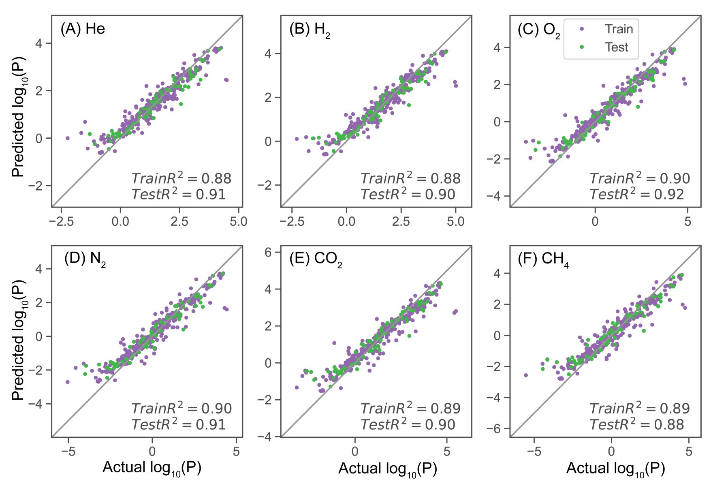
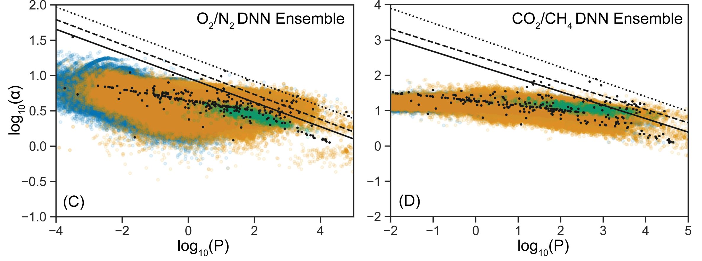

# PolymerGasMembraneML (pgmML)
A machine-learning framework that can learn an accurate, interpretable model between polymer chemistry and membrane gas permeability. Please refer to our work "Discovery of High-Performance Polymers for Gas-Separation Membranes using Interpretable Machine Learning" for additional details.

## Installation
To download, clone this repository
```
git clone https://github.com/jsunn-y/PolymerGasMembraneML
```
To run any code in this repository that does not require chemical feature calculation via rdkit, the relevant anaconda environment can be installed from `pgmML.yml`. To build this environment, run
```
cd ./PolymerGasMembraneML
conda env create -f pgmML.yml
```
However, for calculating chemical descriptors and fingerprints, a separate rdkit environment is required. Installation instructions can be found in [rdkit documentation](https://www.rdkit.org/docs/Install.html).

## Datasets
In addition to the training dataset, Dataset A, we use 3 screening datasets in this work: Dataset B, C, and D. Due to large size of Datasets B and C, we do not include any calculated features in our hub, and for Dataset C, we only include the first 1 million SMILES strings. 
However all the datasets used in this work, including smiles and calculated fingerprints, can be downloaded [here](https://drive.google.com/file/d/1NPh3Hx3nHakUH4bgp24Ie1KCEAvZnCr4/view?usp=sharing).

## General Use
Referring to Figure 1 in our paper, there are 5 steps in our ML training and discovery workflow.
1. We have curate a dataset of SMILES strings and permeabities, and the results are contained in the `/datasets` folder.
2. The chemical features of the training set have been computed and uploaded to the `/datasets` folder. All remaining fingerprints and datasets have been generated via rdkit and uploaded at the [same link as above](https://drive.google.com/file/d/1NPh3Hx3nHakUH4bgp24Ie1KCEAvZnCr4/view?usp=sharing). Running `step2_generateXfeatures.py` to calculate chemical features is optional, but we have included the code for those who might find it beneficial
3. We recommend training our top-performing ML model, a DNN ensemble trained using Morgan fingerprints as inputs with permeabilities imputed using Bayesian Linear Regression:
```
python step3_train.py --features 'fing' --imputation 'BLR' --model 'DNN'
```
Alternatively, one can also train on descriptors, use extremely randomized trees for imputation, and train a random forest. We also include several pretrained models in `/pretrained_models` that reproduce the results demonstrated in our paper.

Using the saved models, it is possible to extract the model's SHAP values in step 3.5. For example, run:
```
python step3.5_SHAP.py --modelname 'DNN_BLR_fing'
```
4. As part of the discovery framework, we also screen large datasets of polymers to predict their permeabilities and identify promising candidates. To screen Dataset B on the model that we trained and analyzed above, run:
```
python step4_screen.py --modelname 'DNN_BLR_fing' --dataset 'datasetBX_fing.csv'
```
5. MD simulation details are not included here, as the procedure follows that detailed in past works.

## Visualization of Results
The performance of a trained model can be verified via:
```
python plot_modelR2.py --modelname 'DNN_BLR_fing'
```
The predicted and actual permeabilties are plotted like below:
<p align="center"></p> 

Similarly, the SHAP values for physical insights into a trained model can be visualized using the following code:
```
python plot_SHAP.py --modelname 'DNN_BLR_fing'
```

We also offer a template `plot_robeson.py` to visualize permeabilities inthe context of O2/N2 and CO2/CH4 separations, which produces plots like such:
<p align="center"></p> 

## License
Please refer to our paper for details.

